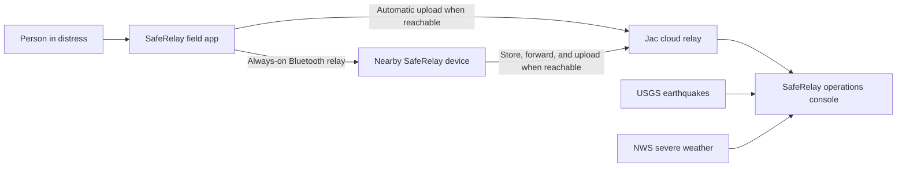

# SafeRelay

**Offline-first emergency relay and evidence-scoped disaster operations, built
with Jac.**

SafeRelay helps people move a distress packet across nearby phones when normal
connectivity is unavailable, then gives operators a source-backed view of
public hazards and received evidence when connectivity returns.

This is the canonical SafeRelay repository and contains both product surfaces:

- `mobile/` is the field relay for composing, validating, storing, and
  forwarding emergency packets.
- `web/` is the authenticated operations console for public hazard monitoring
  and evidence review.

Both applications are independent Jac projects. Native iOS code is limited to
the platform bridges and entitlements that Capacitor cannot express directly.

## How It Works



The mobile app treats each relay hop, cloud upload, responder acknowledgement,
and outcome as a separate piece of evidence. The web console never generates
operational records to fill an empty state. Synthetic markers appear only in
clearly labeled map layers and are excluded from evidence counts.

## Built With Jac

- Jac 0.34.7 for application logic, graph state, protocol policy, tests, and UI
- Typed protected Jac functions for authenticated web RPC
- Typed public Jac ingestion for idempotent mobile cloud receipts
- Per-operator Jac root graphs for isolated console state
- Capacitor 8 for the native mobile shell
- CoreBluetooth for the iOS central and peripheral bridge
- Apple Foundation Models for the optional on-device Survival Guide
- Mapbox GL, USGS, NWS, NOAA, and GDACS for maps and public hazard context

## Run The Web Console

```sh
cd web
export JWT_SECRET="$(openssl rand -hex 32)"
export PROMETHEUS_ADMIN_PASSWORD="$(openssl rand -base64 32)"
export MAPBOX_ACCESS_TOKEN="<public Mapbox token>"
jac install
jac start --dev main.jac
```

Open [http://localhost:8000](http://localhost:8000).

Verify the web project:

```sh
cd web
jac check .
jac test
jac build main.jac
```

## Run The Mobile App

```sh
cd mobile
jac install
bun install
cp -n .env.example .env
# Set SAFERELAY_CLOUD_URL in .env to the public JacHammer deployment origin.
jac check .
jac test tests/protocol_tests.jac tests/operations_tests.jac -v
jac build --client mobile --platform ios
```

The native radio path must be validated on two physical,
Apple Intelligence-capable iPhones. A browser preview, simulator, successful
build, or passing protocol tests does not prove Bluetooth scanning,
advertising, background continuity, or phone-to-phone delivery.

## Repository Layout

| Path | Responsibility |
| --- | --- |
| `mobile/` | Offline-first field relay, protocol, services, tests, and native shell |
| `web/` | Public landing experience and authenticated operations console |
| `design/` | App icon source layers and export tooling |
| `.github/workflows/` | Validation and web deployment automation |

Start with the [mobile documentation](mobile/README.md) or
[web documentation](web/README.md). Production constraints and release gates
for the hosted console are documented in
[web/PRODUCTION.md](web/PRODUCTION.md).

## Evidence Boundary

SafeRelay is not an emergency dispatch service. It does not infer that a
packet was delivered, seen by a responder, or resolved. Those states remain
unknown until their own evidence exists. Public-feed failure retains verified
cached records or reports the source as unavailable; it never creates fallback
incidents.

## Team

Created by Jerry Wen, Rishabh Bansal, and Aditya Das for the Alameda County
Hackathon 2025.

## License

Copyright (c) 2025 SafeRelay Team. All Rights Reserved.

This is proprietary software. No copying, modification, distribution, or
resubmission to hackathons is permitted without explicit written permission.
See [web/LICENSE](web/LICENSE) for the full terms.
