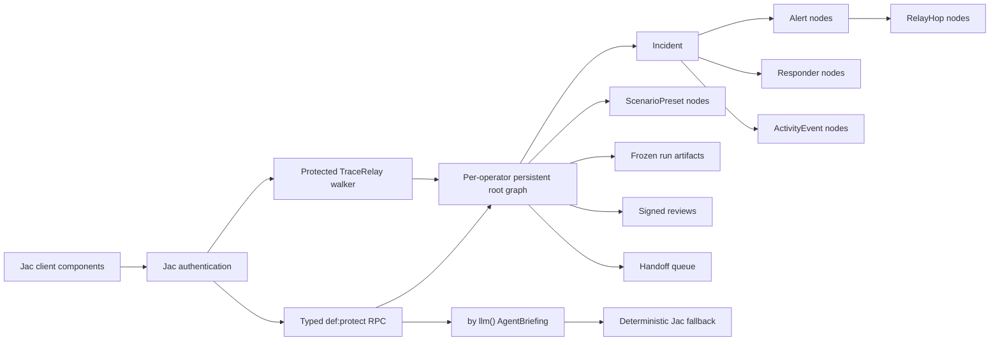

# SafeRelay

**Graph-native emergency mesh operations, built entirely with Jac.**

SafeRelay turns a simulated phone-to-phone emergency relay into a queryable
operations graph. Operators can generate disaster scenarios, triage and replay
SOS traffic, plan responder coverage, compare frozen runs, sign after-action
reviews, transfer handoffs, monitor public hazard feeds, and ask a typed
incident agent for a grounded action plan from one Jac application.

Created by Jerry Wen, Rishabh Bansal, and Aditya Das for the Alameda County
Hackathon 2025.

> The current experience is a simulated emergency exercise. It demonstrates
> the software workflow and does not connect to real devices or dispatch
> emergency services.

## Why Jac

SafeRelay uses Jac 0.34.7 as the full application runtime:

- **One language:** backend logic, graph schema, agent abilities, tests, routes,
  and JSX-like client components are all Jac.
- **Graph persistence:** incidents connect to alerts, responders, activity, and
  relay hops through typed nodes and edges rooted in Jac's persistent graph.
- **Walker-native provenance:** `TraceRelay` traverses the actual alert-to-hop
  topology instead of reconstructing a path in the browser.
- **Typed protected RPC:** `def:protect` functions become authenticated,
  client-callable endpoints with generated types.
- **Per-operator isolation:** Jac authentication maps every operator to a
  private persistent root graph; unauthenticated visitors cannot mutate drills.
- **Structured agent output:** `by llm()` returns an `AgentBriefing` object. A
  deterministic Jac fallback keeps local drills usable without a model provider.
- **One runtime:** `jac start` builds the client and serves the UI, APIs, walker,
  and graph state together.
- **Frozen training evidence:** presets, archived alerts, event ledgers,
  reviews, and handoffs remain attached to the authenticated operator graph.
- **Live public feeds:** USGS earthquake and NWS severe-weather refreshes run on
  the Jac server with bounded timeouts and an offline continuity snapshot.

## Run It

Install [Jac](https://www.jac-lang.org/install/) and then:

```bash
export JWT_SECRET="$(openssl rand -hex 32)"
export PROMETHEUS_ADMIN_PASSWORD="$(openssl rand -base64 32)"
jac install
jac start --dev main.jac
```

Open:

- Landing experience: [http://localhost:8000](http://localhost:8000)
- Operations drill: [http://localhost:8000/ops](http://localhost:8000/ops)

No database, JavaScript build command, Mapbox account, or Supabase project is
required for a single-replica deployment. To use a live model, configure a
provider supported by Jac's byLLM runtime, set `BYLLM_DEFAULT_MODEL`, and set
`SAFERELAY_LIVE_AGENT=true`. Without that explicit gate, the typed deterministic
briefing is used.

## Verify It

```bash
jac check .
jac test
jac build main.jac
```

The ten-workflow parity suite validates scenario generation, all four disaster
profiles, alert lifecycle and relay provenance, live simulation, preset JSON
round trips, archive/comparison/replay, capacity-aware responders, reviews,
handoffs, and disaster-feed continuity. See [PARITY.md](./PARITY.md).

## Architecture



All incident data sent to the agent comes from the typed graph snapshot. The
agent is explicitly instructed to treat the data as a drill, avoid inventing
facts, and return only the defined `AgentBriefing` schema.

## Source Layout

```text
main.jac                     Application entry point and client export
saferelay/store.jac         Graph, endpoints, walker, agent, and domain logic
saferelay/store_test.jac    Functional parity test suite
saferelay/AppShell.jac      Client router
saferelay/LoginPage.jac     Jac-native authentication
saferelay/LandingPage.jac   Public experience
saferelay/CommandCenter.jac Operations cockpit
styles/global.css            Responsive application styling
jac.toml                     Jac runtime, client, model, and test configuration
PRODUCTION.md                Production and JacHammer runbook
PARITY.md                    Old-to-Jac functional parity contract
```

## Protected Contract

| Surface | Purpose |
| --- | --- |
| `get_snapshot` | Return the typed incident graph projection |
| `reset_drill` | Re-seed one of the supported drill scenarios |
| `configure_drill` | Generate a seeded four-scenario run from all controls |
| `update_drill_runtime` | Persist speed, live mode, sound, and run/pause state |
| `acknowledge_alert` | Persist operator acknowledgement |
| `assign_responder` | Connect and assign an available responder |
| `resolve_alert` | Persist alert resolution and release responders |
| `cancel_alert` | Close an alert with a cancellation record |
| `advance_drill` | Add the next deterministic exercise event |
| Preset functions | Save, import, apply, export, and delete graph presets |
| Archive functions | Freeze, compare, replay, and delete run artifacts |
| Review functions | Score and sign after-action evidence |
| Handoff functions | Create and update the receiving-operator lifecycle |
| Disaster functions | Read cached feeds or refresh USGS and NWS |
| `analyze_incident` | Return a structured, graph-grounded agent briefing |
| `TraceRelay` | Walk the selected alert's verified relay path |

All surfaces in this table require a valid Jac session and run against that
operator's root graph. See [PRODUCTION.md](./PRODUCTION.md) for the production
configuration, environment contract, deployment sequence, and acceptance gates.

## License

Copyright (c) 2025 SafeRelay Team. All Rights Reserved.

This is proprietary software. No copying, modification, distribution, or
resubmission to hackathons is permitted without explicit written permission.
See [LICENSE](./LICENSE) for the full terms.
